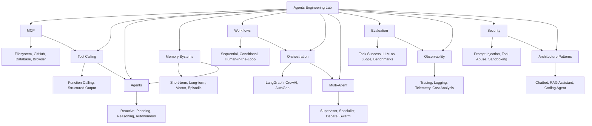

# Agents Engineering Lab — Building Real AI Systems

<!-- BADGES -->

---

## ⚡ Powered By Self-Hosted AI Infrastructure

> **This entire repository — structure, documentation, educational content, and project templates — was generated by a self-hosted AI system.**

### The Infrastructure Behind This Knowledge Base

| Component | Details |
|-----------|---------|
| **Framework** | [ai-self-hosted-hw](https://github.com/MarceloSerra/ai-self-hosted-hw) — Self-hosted hardware for AI inference and development |
| **Model** | [Unsloth/Qwen3.6 27B Q2_K_XL](https://huggingface.co/unsloth/Qwen3.6-27B-instruct-2507-q4_k_s) — Quantized Qwen3.6 27B parameter model via Unsloth optimization |
| **Quantization** | Q2_K_XL (GGUF format) — Extreme quantization for efficient local inference on consumer hardware |
| **Approach** | Local-first, self-hosted AI — No cloud APIs, no external dependencies |

### Why This Matters

This repository demonstrates a critical principle: **self-hosted AI infrastructure can produce structured, high-quality engineering handbooks autonomously.**

The same framework that powers this encyclopedia ([ai-self-hosted-hw](https://github.com/MarceloSerra/ai-self-hosted-hw)) enables:
- Local LLM inference without cloud dependencies
- Quantized models running on consumer hardware
- Autonomous repository generation and documentation
- Self-contained AI development workflows

This is not just a learning resource — it's proof that self-hosted AI infrastructure works at scale.

### Learn More About the Infrastructure

- **[ai-self-hosted-hw](https://github.com/MarceloSerra/ai-self-hosted-hw)** → Full framework documentation and setup guides
- **[Unsloth](https://github.com/unslothai/unsloth)** → Optimized LLM inference for efficient local deployment
- **Qwen3.6 27B** → State-of-the-art open-source language model

---

> A practical engineering handbook for building AI-powered systems. Not about training models. Not about ML theory. About building real AI applications that work in production.

## What This Repository Is NOT

This repository is **NOT**:
- ❌ A machine learning course — No gradient descent, no backpropagation derivations
- ❌ A model training guide — No fine-tuning tutorials, no LoRA/QLoRA walkthroughs
- ❌ An academic paper collection — No research summaries or literature reviews

This repository is **ABOUT**:
- ✅ Building AI agents that take actions in the real world
- ✅ Connecting LLMs to tools, databases, APIs, and systems
- ✅ Designing multi-agent architectures for complex workflows
- ✅ Implementing memory, observability, and evaluation in production
- ✅ Making architectural decisions for AI-powered applications

## Problem → Solution Decision Tree

| I need to build... | Start here | Then explore |
|--------------------|------------|--------------|
| An LLM that can call external functions | [Tool Calling](tool-calling/README.md) | Function Calling, External APIs |
| Standardized tool access across agents | [MCP](mcp/README.md) | MCP Servers, Custom MCP |
| An agent that plans and executes tasks | [Agents](agents/README.md) | Reactive Agents, Planning Agents |
| Persistent memory for AI systems | [Memory](memory/README.md) | Vector Memory, Episodic Memory |
| Sequential or conditional workflows | [Workflows](workflows/README.md) | Human-in-the-Loop, Approval Workflows |
| Multiple agents collaborating | [Multi-Agent](multi-agent/README.md) | Supervisor Pattern, Specialist Pattern |
| Agent coordination with state management | [Orchestration](orchestration/README.md) | LangGraph, CrewAI |
| Evaluation of agent performance | [Evaluation](evaluation/README.md) | Task Success, LLM-as-a-Judge |
| Monitoring AI systems in production | [Observability](observability/README.md) | Tracing, Telemetry |
| Security for AI applications | [Security](security/README.md) | Prompt Injection, Sandboxing |
| Production-ready architecture patterns | [Architecture Patterns](architecture-patterns/README.md) | RAG Assistant, Coding Agent |

---

## Repository Structure

---

## Learning Path

### Phase 1: Foundations — Connecting LLMs to Tools (2-3 weeks)
Start with the basics of making AI systems interact with the world.

| Topic | Directory | Time |
|-------|-----------|------|
| Tool Calling Basics | [tool-calling/](tool-calling/README.md) | 1 week |
| MCP Fundamentals | [mcp/](mcp/README.md) | 1-2 weeks |
| Function Calling & Structured Output | tool-calling/function-calling/, tool-calling/structured-output/ | 0.5 week |

### Phase 2: Building Agents (3-4 weeks)
Learn to build agents that can plan, reason, and execute tasks autonomously.

| Topic | Directory | Time |
|-------|-----------|------|
| Agent Architectures | [agents/](agents/README.md) | 1 week |
| Reactive & Planning Agents | agents/reactive-agents/, agents/planning-agents/ | 1 week |
| Memory Systems | [memory/](memory/README.md) | 1-2 weeks |

### Phase 3: Multi-Agent Systems (4-6 weeks)
Scale from single agents to coordinated multi-agent systems.

| Topic | Directory | Time |
|-------|-----------|------|
| Workflows & Orchestration | [workflows/](workflows/README.md), [orchestration/](orchestration/README.md) | 2 weeks |
| Multi-Agent Patterns | [multi-agent/](multi-agent/README.md) | 2-3 weeks |

### Phase 4: Production Readiness (Ongoing)
Make your AI systems reliable, observable, and secure.

| Topic | Directory | Time |
|-------|-----------|------|
| Evaluation & Observability | [evaluation/](evaluation/README.md), [observability/](observability/README.md) | 2 weeks |
| Security | [security/](security/README.md) | 1-2 weeks |
| Architecture Patterns | [architecture-patterns/](architecture-patterns/README.md) | Ongoing |

---

## Quick Navigation

### Core Technologies
- [MCP (Model Context Protocol)](mcp/README.md) — Standardized tool access for AI systems
- [Tool Calling](tool-calling/README.md) — Connecting LLMs to external functions
- [Agents](agents/README.md) — Building autonomous AI agents

### System Design
- [Memory Systems](memory/README.md) — Persistent memory for AI applications
- [Workflows](workflows/README.md) — Sequential and conditional workflows
- [Orchestration](orchestration/README.md) — Agent coordination frameworks
- [Multi-Agent Systems](multi-agent/README.md) — Collaborative agent architectures

### Production Engineering
- [Evaluation](evaluation/README.md) — Measuring agent performance
- [Observability](observability/README.md) — Monitoring AI systems in production
- [Security](security/README.md) — Securing AI applications against attacks
- [Architecture Patterns](architecture-patterns/README.md) — Production-ready architectures

### Practical Projects
- [Hardware Assistant](projects/hardware-assistant/README.md) — Investigate hardware metrics with AI
- [Coffee Assistant](projects/coffee-assistant/README.md) — Recommend coffees based on preferences
- [GitHub Researcher](projects/github-researcher/README.md) — Analyze repositories with AI agents
- [Orbitarium Engineer](projects/orbitarium-engineer/README.md) — Assist development workflows

### Documentation
- [Docs](docs/) — Additional documentation and guides

---

## How to Use This Repository

1. **Identify your problem** — Use the decision tree above
2. **Navigate to the relevant section** — Follow links from this README
3. **Read the educational content** — Understand what, why, when, and tradeoffs
4. **Try practical experiments** — Each section includes hands-on projects
5. **Build real applications** — Use project templates as starting points

---

## Difficulty Levels

- 🟢 **Beginner** — Start here, foundational concepts
- 🟡 **Intermediate** — Requires understanding of prerequisites
- 🔴 **Advanced** — Deep technical knowledge required

---

## Credits & Infrastructure

This repository was autonomously generated using self-hosted AI infrastructure. The entire structure, documentation, educational content, and project templates were produced without cloud APIs or external services.

### Built With

| Component | Link | Description |
|-----------|------|-------------|
| **ai-self-hosted-hw** | [GitHub](https://github.com/MarceloSerra/ai-self-hosted-hw) | Self-hosted hardware framework for AI inference and development — the foundation of this project |
| **Unsloth/Qwen3.6 27B Q2_K_XL** | [HuggingFace](https://huggingface.co/unsloth/Qwen3.6-27B-instruct-2507-q4_k_s) | Quantized 27B parameter model optimized for efficient local inference on consumer hardware |
| **Unsloth** | [GitHub](https://github.com/unslothai/unsloth) | Fast LLM fine-tuning and inference optimization framework |

### The Philosophy

This repository exists to prove a point: **self-hosted AI infrastructure is viable, practical, and capable of producing structured engineering handbooks at scale.**

By running locally — without cloud dependencies, API costs, or external services — this handbook demonstrates that:
- Local LLMs can generate comprehensive technical documentation
- Quantized models maintain quality while running on consumer hardware
- Self-hosted workflows enable autonomous AI development
- Open-source infrastructure empowers independent knowledge creation

The [ai-self-hosted-hw](https://github.com/MarceloSerra/ai-self-hosted-hw) framework makes this possible. Explore it to build your own self-hosted AI systems.

### License

This repository is available under the MIT License. See [LICENSE](LICENSE) for details.
