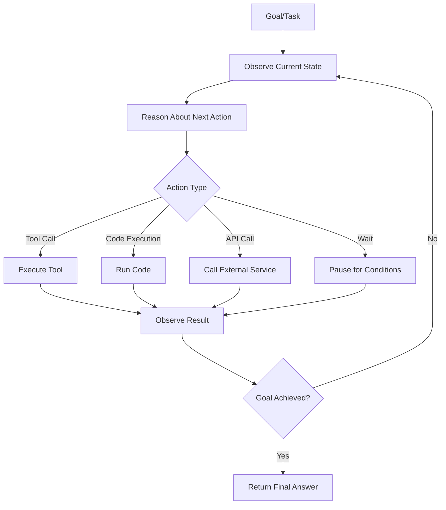

# Agents

## What is it?
AI Agents are autonomous systems that use language models as reasoning engines to plan, execute actions, and achieve goals. Unlike simple chatbots, agents take actions in the world — calling tools, browsing web, writing code, or interacting with APIs — then observe results and adapt their behavior accordingly.

## Why does it exist?
Single LLM calls have fundamental limitations:
- Can't access real-time information without retrieval mechanisms
- Can't execute code or interact with systems directly
- Struggle with multi-step complex tasks without memory and feedback loops
- Need iterative correction to handle errors and edge cases

Agents solve these by combining LLM reasoning with action execution, observation, and adaptive planning.

## Agent Architectures

| Architecture | Description | Best For |
|--------------|-------------|----------|
| **Reactive** | Sense → Act loop without explicit planning | Simple tasks, immediate responses |
| **Planning** | Goal decomposition into subtasks before execution | Complex multi-step workflows |
| **Reasoning** | Deep analysis and deliberation before action | Problem-solving requiring thought |
| **Autonomous** | Self-directed goal pursuit with minimal human input | Long-running processes, background tasks |

## Core Agent Loop

## Key Agent Components

| Component | Purpose | Implementation Options |
|-----------|---------|------------------------|
| **Memory** | Store context, history, and learned information | Short-term buffers, long-term vector stores |
| **Tools** | Enable interaction with external systems | MCP servers, direct API calls, function calling |
| **Planning** | Break down complex goals into actionable steps | Task decomposition, hierarchical planning |
| **Reflection** | Evaluate actions and improve future behavior | Self-assessment, feedback loops |

## When should I use Agents?
- Automating multi-step workflows that require reasoning
- Tasks requiring external tool interaction and adaptation
- Research and information gathering across multiple sources
- Complex problem-solving with iterative refinement
- Applications where human oversight is available but not constant

## When should I NOT use Agents?
- Simple single-step tasks → Direct LLM call is faster/cheaper/more reliable
- High-reliability requirements — agents can fail unpredictably in complex scenarios
- Real-time latency constraints — agent loops add delay through reasoning and tool calls
- Tasks where deterministic code suffices without AI reasoning overhead

## Tradeoffs

| Aspect | Agents | Direct LLM Calls |
|--------|--------|------------------|
| Capabilities | Extended with tools, memory, planning | Limited to model training and prompting |
| Complexity | Higher implementation and maintenance cost | Simpler prompt/response architecture |
| Reliability | Variable — depends on tool availability and reasoning quality | More predictable for well-defined tasks |
| Cost | Higher per-task due to multiple LLM calls and tool usage | Lower per-interaction cost |

## Related Topics
- [Tool Calling](../tool-calling/README.md) — How agents interact with external systems
- [Memory](../memory/README.md) — Persistent memory for agent state and history
- [Workflows](../workflows/README.md) — Structured agent execution patterns
- [Evaluation](../evaluation/README.md) — Measuring agent performance and reliability

## Practical Experiments
1. Build a web research agent that summarizes topics from multiple sources
2. Create a code debugging agent that fixes errors iteratively
3. Design an agent that automates data analysis workflows with tool usage
4. Implement a planning agent that breaks down complex goals into subtasks

---

Difficulty Level: 🟡 Intermediate → 🔴 Advanced
