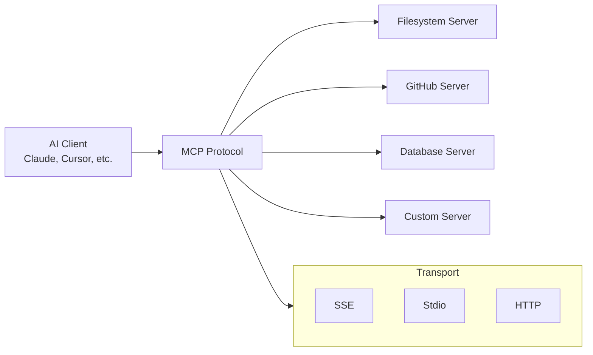

# MCP (Model Context Protocol)

## What is it?
MCP is a standardized protocol that enables AI systems to access tools, data sources, and external services through a unified interface. Instead of each LLM provider implementing custom tool integrations, MCP provides a common standard for connecting AI models to the world around them.

## Why does it exist?
Before MCP, every AI system needed its own proprietary way to connect to tools:
- Different SDKs for different providers
- Custom integration code for each service
- No interoperability between AI systems and tools
- Vendor lock-in for tool implementations

MCP solves this by providing a universal protocol that any AI client can use with any MCP server.

## Architecture

## Core Concepts

| Concept | Description |
|---------|-------------|
| **MCP Client** | AI system that consumes MCP servers (Claude, Cursor, etc.) |
| **MCP Server** | Service that exposes tools, resources, and prompts via MCP |
| **Transport** | Communication mechanism between client and server (SSE, stdio) |
| **Tools** | Functions the AI can call through the MCP protocol |
| **Resources** | Data sources the AI can access (files, databases, APIs) |
| **Prompts** | Pre-defined prompt templates exposed by servers |

## When should I use it?
- Building tools that multiple AI clients should access
- Standardizing tool integrations across your organization
- Creating reusable tool implementations for different AI systems
- Needing interoperability between AI platforms and services

## When should I NOT use it?
- Simple single-client integration → Direct tool calling is simpler
- Proprietary workflows where standardization adds overhead
- Performance-critical paths where protocol abstraction costs matter
- Early-stage prototyping where MCP setup complexity isn't justified

## Tradeoffs

| Aspect | With MCP | Without MCP |
|--------|----------|--------------|
| Interoperability | High — any client can use servers | Low — custom integration per provider |
| Setup Complexity | Higher initial investment | Lower for single integrations |
| Maintenance | Centralized server updates | Distributed across implementations |
| Standardization | Protocol guarantees consistency | Custom conventions vary by implementation |

## Related Topics
- [Tool Calling](../tool-calling/README.md) — MCP vs direct tool calling comparison
- [Agents](../agents/README.md) — Agents using MCP for tool access
- [Security](../security/README.md) — Securing MCP connections and permissions

## Practical Experiments
1. Set up a local filesystem MCP server and connect it to an AI client
2. Build a custom MCP server that exposes your own tools
3. Compare MCP vs direct tool calling for the same integration
4. Implement SSE transport for remote MCP server access

---

Difficulty Level: 🟡 Intermediate
