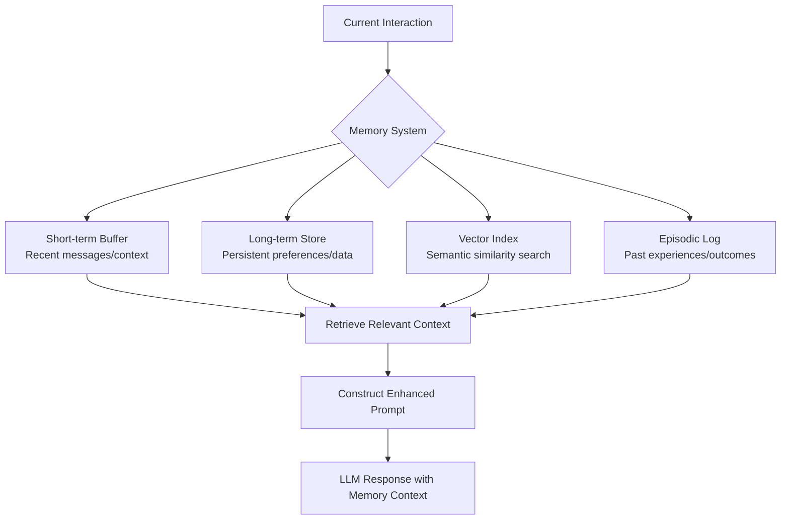

# Memory Systems

## What is it?
Memory systems enable AI applications to persist information across interactions, sessions, and time periods. Without memory, each interaction starts from scratch — with memory, AI systems build context, learn preferences, and maintain continuity like human conversations.

## Why does it exist?
LLMs have fundamental memory constraints:
- **Context window limits** — Models can only hold so much information at once
- **No persistent state** — Each call is independent without external memory
- **Session boundaries** — Conversations reset between interactions
- **Knowledge decay** — Important details get lost as new content fills context

Memory systems solve these by providing structured storage and retrieval mechanisms that extend beyond immediate context windows.

## Memory Types

| Type | Duration | Use Case | Implementation |
|------|----------|----------|----------------|
| **Short-term** | Current session/conversation | Immediate context, recent interactions | Context window buffers, message history |
| **Long-term** | Across sessions/time periods | Persistent preferences, learned patterns | Databases, vector stores, file systems |
| **Vector** | Semantic similarity search | Finding related information across time | Embedding databases, semantic retrieval |
| **Episodic** | Specific experiences/events | Learning from past interactions and outcomes | Structured experience logs with metadata |
| **Semantic** | General knowledge/facts | Domain expertise and factual recall | Knowledge bases, structured data stores |

## Memory Architecture

## When should I use Memory?
- Building conversational applications that need continuity across sessions
- Applications where user preferences and history matter for personalization
- Complex workflows requiring context from previous steps or interactions
- Systems learning from past experiences to improve future behavior
- Multi-turn interactions where earlier decisions affect later outcomes

## When should I NOT use Memory?
- Simple single-interaction tasks → No memory overhead needed
- Privacy-sensitive applications where data persistence creates compliance issues
- Stateless services designed for simplicity and predictability
- Applications where context window alone suffices for the task scope

## Tradeoffs

| Aspect | With Memory | Without Memory |
|--------|-------------|----------------|
| Continuity | High — maintains context across interactions | Low — each interaction starts fresh |
| Complexity | Higher implementation and maintenance cost | Simpler stateless architecture |
| Performance | Retrieval overhead adds latency | Faster response generation |
| Storage | Requires persistent storage infrastructure | No storage requirements beyond model |

## Related Topics
- [Agents](../agents/README.md) — Agents using memory for state persistence
- [Workflows](../workflows/README.md) — Workflow state management with memory
- [Evaluation](../evaluation/README.md) — Evaluating memory retrieval accuracy and relevance

## Practical Experiments
1. Build a conversational assistant that remembers user preferences across sessions
2. Implement vector-based semantic search for retrieving relevant past interactions
3. Create episodic memory system that learns from successful and failed outcomes
4. Design hybrid memory combining short-term context with long-term knowledge retrieval

---

Difficulty Level: 🟡 Intermediate
