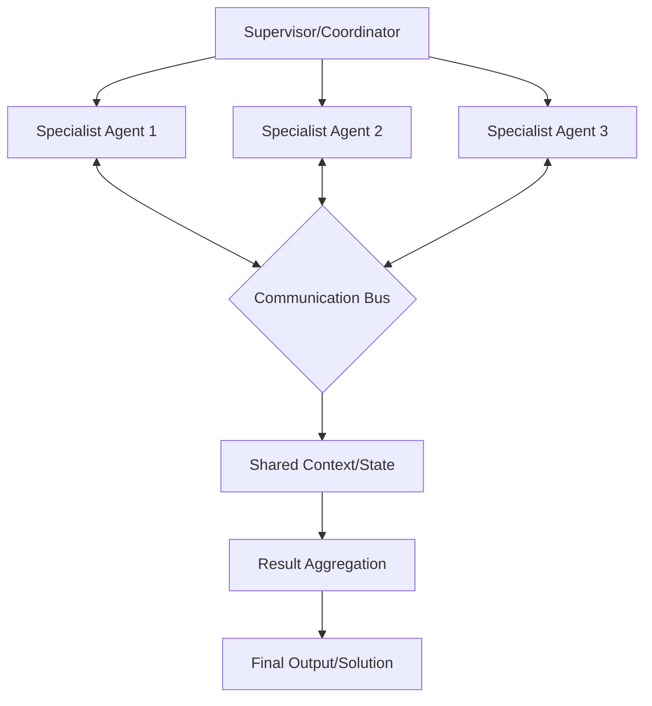

# Multi-Agent Systems

## What is it?
Multi-agent systems involve multiple AI agents collaborating to accomplish complex objectives that single agents cannot achieve alone. Rather than relying on one agent for all tasks, multi-agent systems distribute work across specialized agents with coordinated communication and collaboration patterns.

## Why does it exist?
Single agents face fundamental limitations:
- **Specialization limits** — One agent can't excel at every type of task simultaneously
- **Cognitive overload** — Complex problems overwhelm single agent reasoning capacity
- **Perspective diversity** — Single viewpoints miss alternative solutions and approaches
- **Scalability constraints** — Growing complexity requires distributed processing

Multi-agent systems solve these by distributing work across specialized agents with coordinated collaboration, diverse perspectives, and scalable architectures.

## Collaboration Patterns

| Pattern | Description | Communication Style | Best For |
|---------|-------------|---------------------|----------|
| **Supervisor** | Central coordinator delegates to specialists | Hierarchical — supervisor directs specialists | Complex tasks requiring expert delegation |
| **Specialist** | Independent experts collaborate on shared goals | Peer-to-peer with role-based contributions | Domain-specific problem solving teams |
| **Debate** | Multiple agents argue different perspectives | Adversarial discussion leading to consensus | Decision making requiring diverse viewpoints |
| **Swarm** | Many simple agents collectively solve problems | Emergent behavior through local interactions | Large-scale optimization and exploration tasks |

## Multi-Agent Architecture

## Key Multi-Agent Components

| Component | Purpose | Implementation Considerations |
|-----------|---------|-------------------------------|
| **Communication Protocol** | How agents exchange information and coordinate actions | Message formats, synchronization, conflict resolution |
| **Role Definition** | Specialized capabilities and responsibilities for each agent | Capability matching, task assignment strategies |
| **State Sharing** | Common context accessible to all collaborating agents | Consistency maintenance, version control, access patterns |
| **Result Aggregation** | Combining individual agent outputs into cohesive solutions | Voting mechanisms, weighted combination, consensus building |

## When should I use Multi-Agent Systems?
- Complex problems requiring diverse expertise and perspectives
- Tasks where specialization improves quality over generalist approaches
- Applications needing scalable processing through distributed agents
- Decision making benefiting from multiple viewpoints and debate
- Research and exploration tasks where diverse approaches yield better discoveries

## When should I NOT use Multi-Agent Systems?
- Simple tasks that single agents handle effectively → Avoid unnecessary complexity
- Latency-sensitive applications where agent coordination adds delay overhead
- Resource-constrained environments where multiple agents exceed available capacity
- Scenarios requiring tight integration rather than distributed collaboration

## Tradeoffs

| Aspect | Multi-Agent Systems | Single Agent Systems |
|--------|---------------------|---------------------|
| Capability Breadth | High — diverse specializations across agents | Limited to single agent capabilities |
| Coordination Complexity | Higher — communication and state management overhead | Lower — direct execution without coordination |
| Resource Requirements | Greater — multiple agents consume more compute/memory | Smaller — single agent resource footprint |
| Solution Quality | Potentially higher through diverse perspectives and collaboration | Limited by individual agent reasoning capacity |

## Related Topics
- [Orchestration](../orchestration/README.md) — Frameworks for coordinating multi-agent systems
- [Workflows](../workflows/README.md) — Structured execution paths across multiple agents
- [Evaluation](../evaluation/README.md) — Measuring multi-agent collaboration effectiveness

## Practical Experiments
1. Build supervisor-specialist system where coordinator delegates to domain experts
2. Implement debate pattern for decision making with opposing viewpoint agents
3. Create specialist team collaborating on complex research problem solving
4. Design swarm architecture for large-scale optimization or exploration tasks

---

Difficulty Level: 🔴 Advanced
