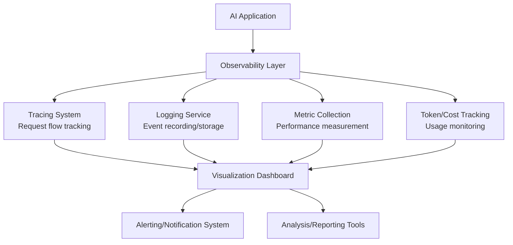

# Observability

## What is it?
Observability provides visibility into AI system behavior through monitoring, tracing, logging, and telemetry collection. Unlike traditional application monitoring, AI observability tracks model decisions, agent reasoning processes, tool usage patterns, and interaction flows that define intelligent system operation.

## Why does it exist?
AI systems create unique observability challenges:
- **Non-deterministic behavior** — Same inputs can produce different outputs across runs
- **Complex decision paths** — Agents make multiple reasoning steps before taking actions
- **External dependencies** — Tool calls, API interactions, and data retrieval add complexity layers
- **Cost tracking** — Token usage, model calls, and computational resources require monitoring

Without observability, you can't debug failures, optimize performance, understand behavior patterns, or ensure reliable operation in production environments.

## Observability Components

| Component | Purpose | Data Collected | Use Cases |
|-----------|---------|----------------|-----------|
| **Tracing** | Track request flows through system components | Span IDs, timestamps, execution paths | Debugging complex multi-step agent workflows |
| **Logging** | Record events and state changes during operation | Event types, messages, context information | Auditing decisions, tracking errors, compliance reporting |
| **Telemetry** | Measure system performance and resource usage | Metrics, counters, histograms, gauges | Performance monitoring, capacity planning, optimization |
| **Token Analysis** | Track language model token consumption patterns | Token counts, costs, model versions | Cost management, efficiency optimization, billing tracking |
| **Cost Analysis** | Monitor financial expenditure across AI operations | Pricing data, usage volumes, budget alerts | Financial oversight, cost control, ROI measurement |

## Observability Architecture

## When should I use Observability?
- Production AI systems requiring reliability and performance monitoring
- Complex agent workflows needing debugging visibility for troubleshooting
- Multi-component architectures where interaction patterns require understanding
- Cost-sensitive applications tracking token usage and computational expenditure
- Compliance environments demanding audit trails and decision documentation

## When should I NOT use Observability?
- Simple single-interaction prototypes where monitoring overhead exceeds value
- Development experimentation phases where rapid iteration matters more than tracking
- Resource-constrained environments where observability infrastructure costs are prohibitive
- Short-lived tasks where historical data collection provides minimal benefit

## Tradeoffs

| Aspect | With Observability | Without Observability |
|--------|-------------------|----------------------|
| Visibility | High — comprehensive behavior understanding and debugging capability | Low — limited insight into system operation and failures |
| Complexity | Higher implementation and maintenance overhead for monitoring infrastructure | Simpler architecture without observability component management |
| Performance Impact | Some overhead from data collection, storage, and processing operations | Better raw performance without monitoring instrumentation costs |
| Operational Insight | Rich debugging, optimization, and improvement opportunities available | Limited ability to identify issues or optimize system behavior |

## Related Topics
- [Evaluation](../evaluation/README.md) — Using observability data for systematic agent assessment
- [Security](../security/README.md) — Monitoring for suspicious behavior patterns and security threats
- [Architecture Patterns](../architecture-patterns/README.md) — Integrating observability into production system designs

## Practical Experiments
1. Implement distributed tracing across multi-agent workflow execution paths
2. Create comprehensive logging system capturing agent decision-making processes
3. Build token usage tracking dashboard for cost monitoring and optimization analysis
4. Design alerting system detecting performance degradation or anomalous behavior patterns

---

Difficulty Level: 🟡 Intermediate → 🔴 Advanced
