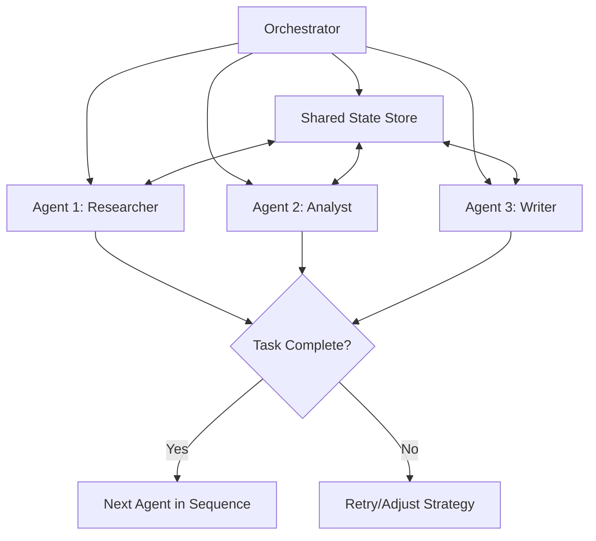

# Orchestration

## What is it?
Orchestration frameworks coordinate multiple AI agents, tools, and workflows into cohesive systems that accomplish complex objectives. Rather than managing individual agent interactions manually, orchestration provides structured coordination mechanisms for multi-component AI applications.

## Why does it exist?
Individual agents have limitations when working together:
- **Coordination complexity** — Multiple agents need communication protocols and task distribution
- **State management** — Shared context across agents requires centralized state handling
- **Workflow execution** — Complex processes need structured step sequencing with agent handoffs
- **Resource optimization** — Efficient agent utilization prevents redundant work and conflicts

Orchestration solves these by providing frameworks that manage agent collaboration, state sharing, task routing, and workflow execution.

## Major Orchestration Frameworks

| Framework | Approach | Strengths | Best For |
|-----------|----------|-----------|----------|
| **LangGraph** | Graph-based state machines with cycles | Explicit control flow, debugging visibility | Complex workflows with conditional branching |
| **CrewAI** | Role-based agent teams with task assignment | Natural team collaboration patterns | Multi-agent teams with specialized roles |
| **AutoGen** | Conversational agents with group chats | Flexible conversation patterns | Research and exploratory multi-agent systems |
| **Custom** | Tailored orchestration for specific needs | Maximum flexibility for unique requirements | Domain-specific workflows with special constraints |

## Orchestration Architecture

## Key Orchestration Concepts

| Concept | Description | Implementation Considerations |
|---------|-------------|-------------------------------|
| **State Management** | Shared context across agents and workflow steps | Persistent storage, version control, conflict resolution |
| **Task Routing** | Distributing work to appropriate agents based on capabilities | Capability matching, load balancing, priority queuing |
| **Communication Protocols** | How agents exchange information and coordinate actions | Message formats, synchronization mechanisms, error handling |
| **Workflow Execution** | Sequencing agent actions with conditional branching | State machines, DAG execution, human intervention points |

## When should I use Orchestration?
- Complex tasks requiring multiple specialized agents working together
- Applications needing structured coordination between AI components
- Systems where state sharing and context management are critical
- Workflows involving sequential or parallel agent processing
- Production applications requiring reliability and predictability in multi-agent systems

## When should I NOT use Orchestration?
- Simple single-agent tasks → Direct agent implementation is simpler/faster
- Prototyping phases where framework overhead slows experimentation
- Applications where agent independence matters more than coordination
- Scenarios with limited computational resources for orchestration infrastructure

## Tradeoffs

| Aspect | With Orchestration | Without Orchestration |
|--------|-------------------|----------------------|
| Coordination | High — structured agent collaboration | Low — manual or ad-hoc interaction |
| Complexity | Higher framework setup and maintenance | Simpler individual agent management |
| Scalability | Better for growing multi-agent systems | Limited by manual coordination effort |
| Flexibility | Constrained by framework design patterns | More freedom in custom implementations |

## Related Topics
- [Multi-Agent Systems](../multi-agent/README.md) — Agent collaboration patterns within orchestrated frameworks
- [Workflows](../workflows/README.md) — Structured execution paths managed by orchestrators
- [Evaluation](../evaluation/README.md) — Measuring orchestration effectiveness and agent coordination quality

## Practical Experiments
1. Build a research team with LangGraph coordinating researcher, analyst, and writer agents
2. Implement CrewAI role-based teams for content creation workflows
3. Create AutoGen group chats for exploratory problem-solving sessions
4. Design custom orchestrator for domain-specific multi-agent collaboration patterns

---

Difficulty Level: 🔴 Advanced
