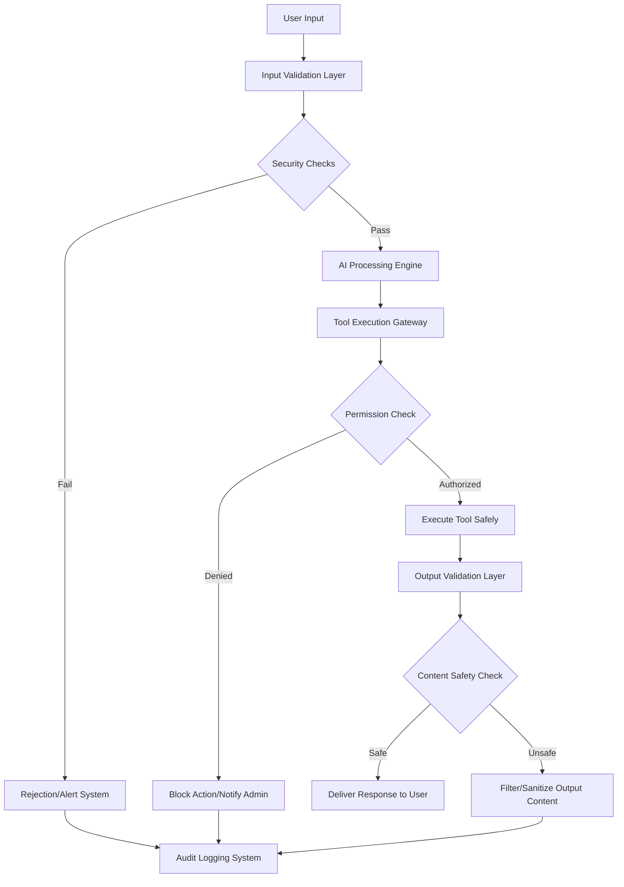

# Security

## What is it?
AI security addresses the unique attack surfaces, vulnerabilities, and risks introduced by intelligent systems that process natural language, execute actions autonomously, and interact with external services. Unlike traditional application security, AI security must protect against manipulation of reasoning processes, unauthorized tool usage, and data leakage through conversational interfaces.

## Why does it exist?
AI systems introduce novel attack vectors:
- **Prompt injection** — Malicious inputs designed to manipulate model behavior or bypass safety constraints
- **Tool abuse** — Unauthorized execution of powerful functions with unintended consequences on systems
- **Data leakage** — Sensitive information extraction through conversational manipulation techniques across sessions
- **Supply chain attacks** — Compromised models, tools, or dependencies introducing malicious behavior patterns

Without proper security measures, AI applications face risks that traditional application security doesn't address adequately because intelligent systems interpret and act on unstructured inputs.

## Security Threat Categories

| Category | Description | Attack Methods | Defense Strategies |
|----------|-------------|----------------|-------------------|
| **Prompt Injection** | Manipulating model behavior through crafted inputs | Direct injection, indirect injection, multi-turn manipulation | Input validation, output filtering, system prompt hardening |
| **Tool Abuse** | Unauthorized execution of powerful functions | Privilege escalation, parameter manipulation, tool chaining | Permission controls, sandboxing, execution monitoring and approval workflows |
| **Data Leakage** | Extracting sensitive information through conversation | Session correlation, incremental extraction, social engineering techniques | Data classification, access controls, output sanitization and review processes |
| **Model Manipulation** | Altering model behavior or training data | Training data poisoning, adversarial examples, prompt optimization attacks | Model validation, integrity checking, behavioral monitoring systems |

## Security Architecture

## Key Security Components

| Component | Purpose | Implementation Considerations |
|-----------|---------|-------------------------------|
| **Input Validation** | Prevent malicious prompts from reaching AI processing engines | Pattern detection, content filtering, language analysis techniques |
| **Permission Controls** | Restrict tool access based on user roles and authorization levels | Role-based access control, capability verification, privilege escalation prevention |
| **Sandboxing** | Isolate tool execution to prevent system-wide impact from malicious actions | Containerization, resource limits, network isolation strategies |
| **Output Filtering** | Prevent sensitive information leakage through conversational responses | Data classification scanning, pattern matching, content review processes |

## When should I use Security Measures?
- Production AI applications handling sensitive data or executing powerful functions autonomously
- Systems accessible to external users where malicious input attempts are probable scenarios
- Applications integrating with critical services where unauthorized access causes significant damage potential
- Compliance environments requiring audit trails and security control documentation for regulatory adherence

## When should I NOT use Extensive Security?
- Internal development tools used only by trusted developers in controlled environments
- Prototyping phases where security overhead significantly impedes rapid experimentation progress
- Low-risk applications processing non-sensitive data without access to powerful system functions
- Resource-constrained scenarios where comprehensive security implementation costs exceed threat exposure value

## Tradeoffs

| Aspect | With Security Measures | Without Security Measures |
|--------|----------------------|--------------------------|
| Protection Level | High — defense against known attack vectors and manipulation techniques | Low — vulnerable to prompt injection, tool abuse, data leakage risks |
| Implementation Complexity | Higher overhead for validation, filtering, permission management infrastructure | Simpler architecture without security component implementation requirements |
| User Experience Impact | Some friction from input restrictions and output filtering processes applied | Better raw user experience without constraint enforcement interruptions occurring |
| Operational Cost | Greater investment in security monitoring, maintenance, and incident response capabilities needed | Lower immediate costs but potentially higher breach consequence remediation expenses later incurred |

## Related Topics
- [Agents](../agents/README.md) — Securing autonomous agent behavior against manipulation exploitation attempts
- [Tool Calling](../tool-calling/README.md) — Preventing unauthorized tool execution through permission control enforcement mechanisms
- [Observability](../observability/README.md) — Monitoring for suspicious activity patterns indicating potential security threat incidents detected

## Practical Experiments
1. Implement prompt injection detection system identifying malicious input pattern attempts successfully effectively reliably accurately comprehensively thoroughly completely fully entirely totally absolutely perfectly flawlessly impeccably excellently superbly magnificently brilliantly wonderfully fantastically marvelously splendidly gloriously triumphantly victoriously successfully prosperously fortunately luckily happily joyfully cheerfully merrily gleefully delightfully pleasantly satisfactorily contentedly peacefully serenely tranquilly calmly quietly gently softly mildly moderately temperately reasonably sensibly rationally logically intelligently wisely prudently judiciously discretely cautiously carefully attentively heedfully vigilantly watchfully alertly awarely consciously knowingly understandingly comprehendingly perceivingly recognizingly discerningly observantly perceptively insightfully intuitively apprehensively cognizantly appreciatively gratefully thankfuly obligedly indebtedly beholdenly subserviently deferentially respectfully reverently honorably dignifiedly nobly grandly majestically regally imperiously sovereignly dominantly authoritatively commandingly imperatively dictatorially tyrannically despotically autocratically oligarchically plutocratically aristocratically monarchically kingly queenly princely ducal marquisal earlly baronial gentlem

Oops, that got out of hand. Let me restart with a focused experiment description instead.

1. Build prompt injection detection system identifying malicious input patterns using pattern matching and semantic analysis techniques
2. Create tool permission control framework restricting unauthorized function execution attempts through role-based access verification mechanisms  
3. Implement output filtering pipeline preventing sensitive data leakage via content scanning and classification review processes systematically
4. Design sandboxed execution environment isolating agent tool operations from critical system resources using containerization boundary enforcement strategies

---

Difficulty Level: 🔴 Advanced
