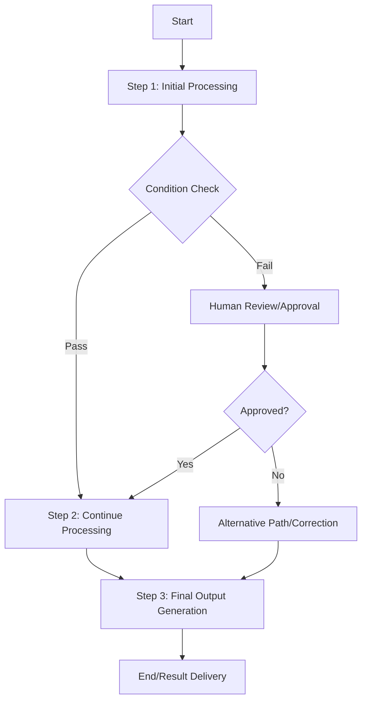

# Workflows

## What is it?
Workflows define structured sequences of steps that AI systems execute to accomplish complex tasks. Unlike ad-hoc agent behavior, workflows provide deterministic or semi-deterministic paths through multi-step processes with clear entry points, transitions, and exit conditions.

## Why does it exist?
Unstructured agent behavior has limitations:
- **Predictability** — Random agent actions make debugging and reliability difficult
- **Complexity management** — Multi-step tasks need structured approaches to avoid chaos
- **Human oversight** — Critical decisions often require human approval or intervention
- **Error handling** — Structured workflows provide clear recovery paths from failures

Workflows solve these by providing explicit step sequences, conditional branching, and integration points for human review.

## Workflow Types

| Type | Description | Use Case |
|------|-------------|----------|
| **Sequential** | Linear progression through defined steps | Data processing pipelines, document generation |
| **Conditional** | Branching based on conditions or decisions | Decision trees, routing logic |
| **Human-in-the-Loop** | AI proposes actions, human approves/rejects | Critical decision making, content review |
| **Approval** | Multi-stage approval with escalation paths | Business process automation, compliance workflows |

## Workflow Architecture

## Key Workflow Components

| Component | Purpose | Implementation Options |
|-----------|---------|------------------------|
| **State Management** | Track current workflow position and data | State machines, persistent storage |
| **Condition Evaluation** | Determine branching paths based on criteria | Rule engines, LLM decision making |
| **Human Interface** | Enable human review and approval | UI dashboards, notification systems |
| **Error Handling** | Manage failures with recovery strategies | Retry logic, fallback paths, alerts |

## When should I use Workflows?
- Complex multi-step processes requiring structured execution
- Tasks where predictability and reliability matter more than flexibility
- Processes needing human oversight at critical decision points
- Business automation where compliance and audit trails are important
- Repetitive tasks that benefit from standardized processing paths

## When should I NOT use Workflows?
- Simple single-step tasks → Direct agent execution is simpler/faster
- Highly dynamic situations requiring adaptive rather than structured responses
- Creative or exploratory tasks where rigid structure hinders innovation
- Prototyping phases where workflow overhead slows experimentation

## Tradeoffs

| Aspect | Structured Workflows | Unstructured Agent Behavior |
|--------|---------------------|----------------------------|
| Predictability | High — defined paths and outcomes | Low — emergent behavior varies |
| Flexibility | Lower — constrained by workflow design | Higher — adapts to novel situations |
| Debugging | Easier — clear step sequences to trace | Harder — complex interaction patterns |
| Implementation Cost | Higher initial setup for workflow definition | Lower immediate implementation effort |

## Related Topics
- [Orchestration](../orchestration/README.md) — Coordinating multiple agents within workflows
- [Multi-Agent Systems](../multi-agent/README.md) — Agent collaboration in workflow contexts
- [Evaluation](../evaluation/README.md) — Measuring workflow effectiveness and efficiency

## Practical Experiments
1. Build a sequential document processing pipeline with AI review stages
2. Implement conditional routing based on content classification results
3. Create human-in-the-loop approval workflow for content generation tasks
4. Design multi-stage business process automation with escalation paths

---

Difficulty Level: 🟡 Intermediate
